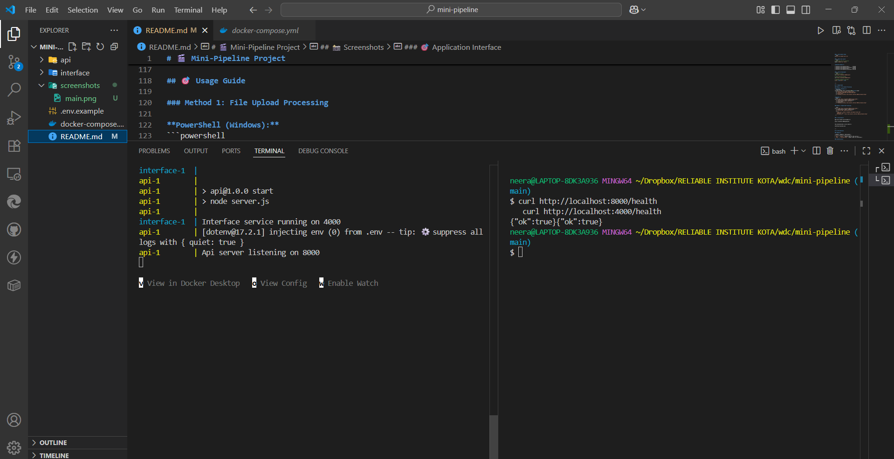
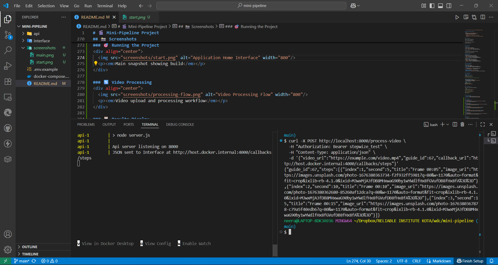
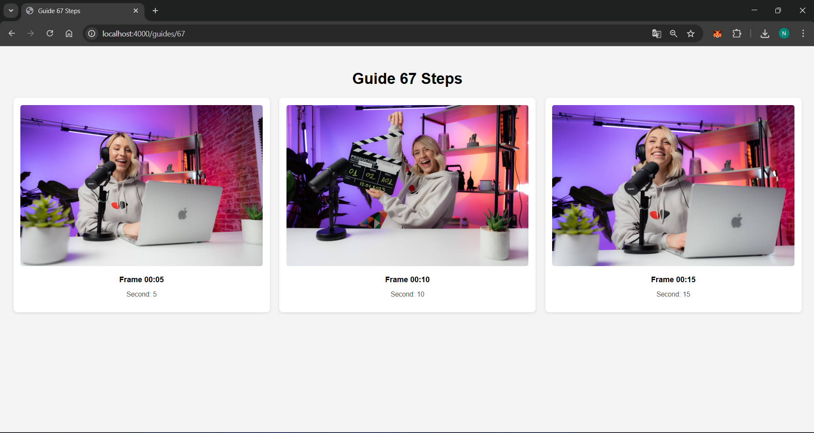
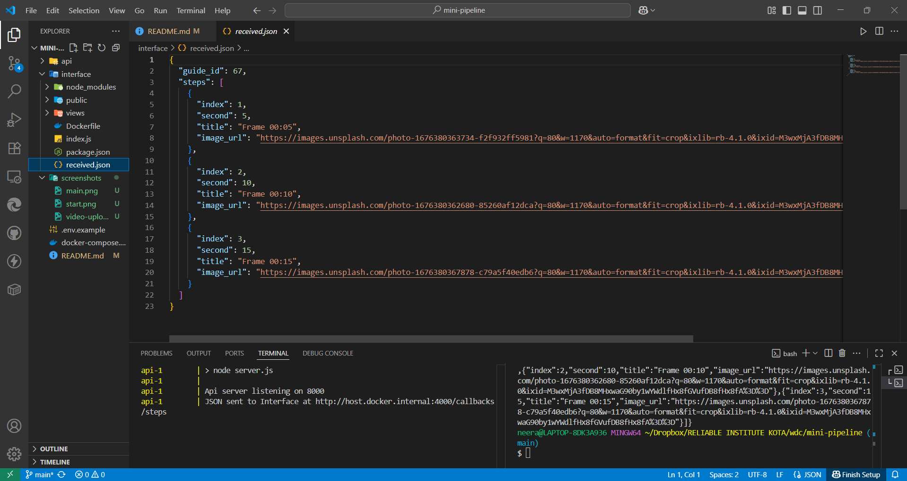

# 🎬 Mini-Pipeline Project

[](https://www.docker.com/)
[](https://nodejs.org/)
[](https://expressjs.com/)

## 📋 Overview

A **scalable video processing pipeline** built with Node.js and Docker that automates video analysis and step extraction. The system consists of two microservices working in tandem to process videos and deliver structured results through a clean web interface.

### 🏗️ Architecture

```
┌─────────────────┐    HTTP/REST    ┌──────────────────┐
│   API Service   │ ──────────────► │ Interface Service│
│   (Port 8000)   │                 │   (Port 4000)    │
│                 │                 │                  │
│ • Video Upload  │                 │ • Result Display │
│ • Processing    │                 │ • Web Interface  │
│ • Callbacks     │                 │ • Data Storage   │
└─────────────────┘                 └──────────────────┘
```

### 🚀 Key Features

- **Containerized Architecture**: Fully containerized with Docker Compose
- **Dual Input Methods**: Support for file uploads and remote video URLs
- **Callback System**: Asynchronous processing with webhook notifications
- **Health Monitoring**: Built-in health checks for both services
- **Persistent Storage**: Docker volume mapping for data persistence
- **Cross-Platform**: Optimized for Windows with WSL2 support

---

## 🛠️ Prerequisites

### Required Software
- **Windows 10/11** with WSL2 installed and configured
- **Docker Desktop** with WSL2 backend enabled
- **Git** for cloning the repository

### Verification Commands
```bash
# Verify Docker installation
docker --version
docker compose --version

# Verify WSL2 integration
wsl --list --verbose
```

---

## 📁 Project Structure

```
mini-pipeline/
├── 📁 api/                    # API microservice
│   ├── 🐳 Dockerfile         # API container configuration
│   ├── ⚙️ .env.example       # Environment variables template
│   ├── 📦 package.json       # API dependencies
│   └── 🚀 server.js          # API server implementation
├── 📁 interface/             # Interface microservice  
│   ├── 📁 public/            # Static assets
│   │   └── 🎨 style.css      # Stylesheet
│   ├── 📁 views/             # EJS templates
│   │   └── 📄 guide.ejs      # Guide display template
│   ├── 🐳 Dockerfile         # Interface container configuration
│   ├── 🚀 index.js           # Interface server implementation
│   └── 📦 package.json       # Interface dependencies
├── 🐳 docker-compose.yml     # Multi-container orchestration
└── 📖 README.md              # Project documentation
```

---

## 🚀 Quick Start

### 1. Clone and Navigate
```bash
git clone https://github.com/neerajrao23/mini-pipeline
cd mini-pipeline
```

### 2. Environment Setup
```bash
cp api/.env.example api/.env
```

### 3. Build and Launch
```bash
# Build and start all services
docker compose up --build
```

**Expected Output:**
```
✓ Container mini-pipeline-api-1       Created
✓ Container mini-pipeline-interface-1 Created
✓ Container mini-pipeline-api-1       Started
✓ Container mini-pipeline-interface-1 Started
```

### 4. Verify Deployment
```bash
# Check API health
curl http://localhost:8000/health

# Check Interface health  
curl http://localhost:4000/health

# Expected response from both:
{"ok": true}{"ok": true}
```

---

## 🎯 Usage Guide

### Method 1: File Upload Processing

**Bash/WSL:**
```bash
curl -X POST http://localhost:8000/process-video \
     -H "Authorization: Bearer stepwize_test" \
     -F "video=@C:/temp/demo.mp4;type=video/mp4" \
     -F "guide_id=67" \
     -F "callback_url=http://callback:4000/callbacks/steps"
```

### Method 2: Remote URL Processing

```bash
curl -X POST http://localhost:8000/process-video \
     -H "Authorization: Bearer stepwize_test" \
     -H "Content-Type: application/json" \
     -d '{
    "video_url": "https://example.com/sample-video.mp4",
    "guide_id": 67,
    "callback_url": "http://host.docker.internal:4000/callbacks/steps"
  }'
```

### 📊 View Results

Open your browser and navigate to:
```
http://localhost:4000/guides/67
```

The processed data is also saved to:
```
interface/received.json
```

---

## 🔧 API Reference

### Endpoints

| Method | Endpoint | Description |
|--------|----------|-------------|
| `GET` | `/health` | Health check for API service |
| `POST` | `/process-video` | Submit video for processing |

### Authentication

All API requests require the authorization header:
```
Authorization: Bearer stepwize_test
```

### Request Parameters

#### File Upload
| Parameter | Type | Required | Description |
|-----------|------|----------|-------------|
| `video` | File | Yes | Video file to process |
| `guide_id` | Integer | Yes | Unique guide identifier |
| `callback_url` | URL | Yes | Callback endpoint for results |

#### URL Processing
| Parameter | Type | Required | Description |
|-----------|------|----------|-------------|
| `video_url` | URL | Yes | Remote video URL |
| `guide_id` | Integer | Yes | Unique guide identifier |
| `callback_url` | URL | Yes | Callback endpoint for results |

---

## 🐳 Docker Configuration

### Services Overview

| Service | Port | Purpose |
|---------|------|---------|
| **API** | 8000 | Video processing and API endpoints |
| **Interface** | 4000 | Web interface and callback handling |

### Volume Mappings
- `./interface/received.json` → Persistent result storage
- `./interface/node_modules` → Cached dependencies

### Network Configuration
- **Internal Communication**: Docker bridge network
- **Host Access**: `host.docker.internal` for container-to-host communication

---

## 🔍 Troubleshooting

### Common Issues

#### WSL2 Integration Issues
```bash
# Ensure WSL2 is set as default
wsl --set-default-version 2

# Restart Docker Desktop with WSL2 integration enabled
```

#### File Path Issues (Windows)
- Use forward slashes: `C:/temp/video.mp4`
- Or use PowerShell with backslashes: `C:\temp\video.mp4`
- Ensure file exists and is accessible

### Logs and Debugging
```bash
# View service logs
docker compose logs api
docker compose logs interface
```

---

## 🚦 Health Monitoring

Both services include health check endpoints:

```bash
# API Service Health
curl http://localhost:8000/health

# Interface Service Health  
curl http://localhost:4000/health

# Docker health status
docker compose ps
```

---

## 📈 Performance Notes

- **Storage**: Processed results stored in `received.json`
- **Concurrency**: Supports multiple simultaneous requests

---

## 📸 Screenshots

### 🎯 Running the Project
<div align="center">
  
  <p><em>Main snapshot showing build</em></p>
</div>

### ⚡ Video Processing
<div align="center">
  
  <p><em>Video upload and processing workflow</em></p>
</div>

### 📋 Results Display
<div align="center">
  
  <p><em>Processed video steps and extracted information</em></p>
</div>

### 🔄 received.json
<div align="center">
  
  <p><em>creates received.json and stores json as API send it to INTERFACE</em></p>
</div>

---

## 👨‍💻 Author

**Neeraj Rao**
- 💼 [LinkedIn](https://linkedin.com/in/neeraj-rao-cse)
- 🐱 [GitHub](https://github.com/neerajrao23)

---

## 🙏 Acknowledgments

- Built with Node.js and Express
- Containerized with Docker
- Styled with modern CSS and EJS templating

---
